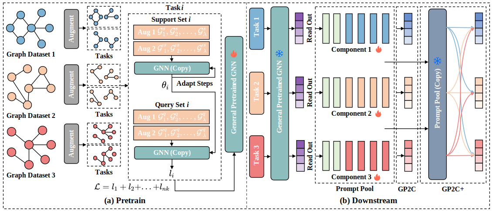

# GP2C

This repository is the official implementation of GP2C and its enhanced version GP2C Plus. 

Paper: [GP2C: General Graph Pretrainng and Prompt Learning Framework with Cross-domain Tasks ]()

Author(s): *Anonymity*




## Requirements

We recommend you to use Python>=3.9 (e.g. Python 3.9.18) to run GP2C.

The requirements exported by pip are given in the repository. To install requirements:

```setup
pip install -r requirements.txt
```


## Script

For Linux, simply run the following command:

```
sh run.sh
```

For Windows, modify the extension and run the command:

```
run.bat
```


## Pre-train

To pre-train the model in the paper, run this command (taking amazon datasets as an example):

```bash
python pretrain.py --task 'node' --dataset 'Amazon_Photo' 'Amazon_Computer' 'Amazon_Fraud' --aug_ratio 0.45 0.45 0.45 0.45 0.45 --input_dim 100 --hidden_dim 100 --output_dim 100 --path 'pretrained_gnn/Amazon_test1.pth'
```

The state dictionary of our pre-trained GNN are provided in folder `pretrained_gnn`-

`Amazon0.45.pth`for `Amazon_Computer`,`Amazon_Photo`and`Amazon_Fraud`; 

`Citation0.15.pth` for `Coauthor_Physics` and  `Coauthor_CS`;

`Molecular0.2.pth` for `COX2`, `BZR` and `DHFR`;

`Biograph0.2.pth` for `ENZYMES` and `PROTEINS`.


## Downstream Task

After pre-training GNN, to perform downstream task, run this command (taking amazon photo as an example):

```bash
python downstream.py --task 'node' --dataset 'Amazon_Photo' --seed 42 --pretrained_model 'pretrained_gnn/Amazon_test1.pth' --input_dim 100 --hidden_dim 100 --output_dim 100 --prompt_dim 100 --save_component_path 'downstream_model/prompt_pool_amazon_photo_test1.pth'
```

Attention: `gnn_layer`,`input_dim`, `hidden_dim` and `output_dim` need to be consistent with the pre-trained GNN.


## GP2C Plus

After performing downstream tasks on **all** the datasets in one domain, find the trained  prompt components and then run GP2C plus: 

```bash
python downstream_plus.py --task 'node' --dataset 'Amazon_Photo' --seed 0 --pretrained_model 'pretrained_gnn/Amazon.pth' --load_components_path 'downstream_model/prompt_pool_amazon_photo_test1.pth' 'downstream_model/prompt_pool_amazon_computer_test1.pth' 'downstream_model/prompt_pool_amazon_fraud_test1.pth' --input_dim 100 --hidden_dim 100 --output_dim 100 --prompt_dim 100
```

Attention: To correctly initialize the weight vectors, the prompt component of current dataset needs to be put in the first place in `load_components_path`.


## LICENSE

This project is licensed under the MIT License - see the LICENSE file for details.
